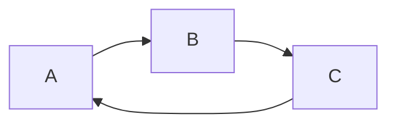
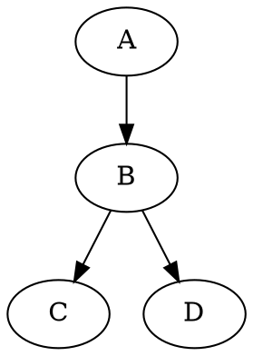

## 标题

# 测试标题1
## 标题2
### 标题3
#### 标题4
##### 标题5
###### 标题6

## 字体
**加粗字体**  
*倾斜*  
***斜体加粗***  
~~文字删除线~~

## 引用
> 引用1
>> 引用2
>>>>> 引用N

## 分割
---
----
***
****

## 图片
*testpic 显示再图片下面的文字，对图片内容的解释*  
*Pic example 图片的标题，鼠标移上时显示的内容*  


## 超链接
[My Github](https://github.com/pananfly)  
<a href="https://github.com/pananfly" target="_blank">My Github</a>

## 列表
###### 无序列表
- 无序1
+ 无序2
* 无序3

###### 有序列表
1. 有序1
2. 有序2
3. 有序3

###### 列表嵌套
- 一级无序
  - 二级无序1
  - 二级无序2
- 一级有序
  1. 二级有序1
  2. 二级有序2

## 表格
*左边第一个--- 至少要有三个-; --: 至少要有两个-*

左对齐|区中对齐|右对齐
---  |  :-: | --:
左对齐1|区中对齐1|右对齐1  
左对齐2|区中对齐2|右对齐2  
左对齐23456|区中对齐23456|右对齐23456

## 代码
`单行引用 assertEquals(4, 2 + 2)`

 ```
代码块
@Test
fun addition_isCorrect() {
    assertEquals(4, 2 + 2)
}
 ```

## 流程图

```flow
st=>start: Start  
op=>operation: Operation  
cond=>condition: Yes or No?  
e=>end: End  
st->op->cond->e 
cond(yes)->e  
cond(no)->op  
```

```flow
st=>start: Start
i=>inputoutput: 输入年份n
cond1=>condition: n能否被4整除？
cond2=>condition: n能否被100整除？
cond3=>condition: n能否被400整除？
o1=>inputoutput: 输出非闰年
o2=>inputoutput: 输出非闰年
o3=>inputoutput: 输出闰年
o4=>inputoutput: 输出闰年
e=>end

st->i->cond1
cond1(no)->o1->e
cond1(yes)->cond2
cond2(no)->o3->e
cond2(yes)->cond3
cond3(yes)->o2->e
cond3(no)->o4->e
```

```flow
s=>start: 开始
e=>end: 结束
o=>operation: 操作项

s->o->e
```



```puml
A --> B
```



```seq
Title: Here is a title
A->B: Normal line
B-->C: Dashed line
C->>D: Open arrow
D-->>A: Dashed open arrow
```